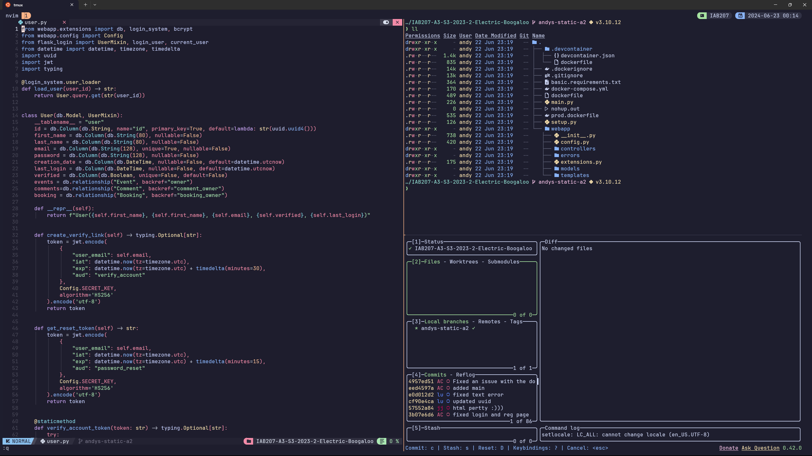

# WSL Stow for ubuntu.



## For experts.
If you are an expert with the terminal and dot files, this is just a gnu stow setup. Simply install the software listed below in your favourite package manager. 
```sh
eza bat git fzf gnumake lazydocker lazygit gh neovim tmux stow fastfetch zoxide jq ripgrep cloudflared
```
Once the software is installed, run stow on the package you want (you know the drill).

## For beginnersers and intermediates.

### Step 1: Setup windows terminal.
This step is for windows terminal users. If you have not installed windows terminal [click here](https://learn.microsoft.com/en-us/windows/terminal/install), you will need wsl2 set up so you will need that completely set up and running Ubuntu [click here](https://learn.microsoft.com/en-us/windows/wsl/install).

#### Step 1.1: Install font.
Once the windows terminal is installed and wsl2 is set up, we need to install jetbrains mono nerdfont from [here](https://www.nerdfonts.com/font-downloads).
I have a link here on how to install [fonts](https://support.microsoft.com/en-au/office/add-a-font-b7c5f17c-4426-4b53-967f-455339c564c1).
I recommend after downloading and extracting, press `ctrl + a` then right click `install`.

#### Step 1.2: Install colour theme.
For this step I reommend having vscode installed and ready to go.
I am personally using Catppuccin Mocha as its a nice dark pastel theme, but you can choose any theme you like.
Catppuccin have in incredable README on how to install a theme (including their theme) to the windows termial which can be found [here](https://github.com/catppuccin/windows-terminal).


### Step 2: Zsh.
When setting up wsl2 Ubuntu, I would recommend running the following command to update and upgrade the packages:
```sh
sudo apt update -y && sudo apt upgrade -y
```
and run

```sh
sudo apt-get install build-essential 
```

#### Step 2.1: Installing zsh.
After you have updated the system, install zsh from the apt package manager with the following command:
```sh
sudo apt install zsh
```
#### Step 2.2: Installing oh-my-zsh.
Next, install oh-my-zsh which provides a framework for zsh to install plugins. This can be done through running:
```sh
sh -c "$(curl -fsSL https://raw.githubusercontent.com/ohmyzsh/ohmyzsh/master/tools/install.sh)"
```
Oh-my-zsh will run a prompt. I recommend going though the prompt and pressing 'Y' when it asks you if you would like to make it the default shell.
You can also find the install command [here](https://ohmyz.sh/#install) from oh-my-zsh's website.

#### Step 2.3: Zsh plugins to make life better int the terminal.
1. zsh-syntax-highlighting
```sh
git clone https://github.com/zsh-users/zsh-syntax-highlighting.git ${ZSH_CUSTOM:-~/.oh-my-zsh/custom}/plugins/zsh-syntax-highlighting
```
The command can be found [here](https://github.com/zsh-users/zsh-syntax-highlighting/blob/master/INSTALL.md#oh-my-zsh).

2. zsh-autosuggestions

```sh
git clone https://github.com/zsh-users/zsh-autosuggestions ${ZSH_CUSTOM:-~/.oh-my-zsh/custom}/plugins/zsh-autosuggestions
```
The command can be found [here](https://github.com/zsh-users/zsh-autosuggestions/blob/master/INSTALL.md#oh-my-zsh).

### Step 3: A pretty prompt.
To make the terminal prompt aesthetically pleasing and performant nstall star ship. Run this commend to install it:
```sh
curl -sS https://starship.rs/install.sh | sh
```
The command can be found [here](https://starship.rs/guide/#%F0%9F%9A%80-installation).

### Step 4: A good package manager and packages.
#### Step 4.1: Installing nix package manager
```sh
sh <(curl -L https://nixos.org/nix/install) --daemon
```
Go through the prompt answering all the prompts, and when it says it will only work after a restart just close the terminal and reopen it. No restart necessary.

#### Step 4.2: Installing packages.
```sh
nix-env -iA nixpkgs.eza nixpkgs.bat nixpkgs.git nixpkgs.fzf nixpkgs.gnumake nixpkgs.lazydocker nixpkgs.lazygit nixpkgs.gh nixpkgs.neovim nixpkgs.tmux nixpkgs.stow nixpkgs.fastfetch nixpkgs.zoxide nixpkgs.jq nixpkgs.ripgrep nixpkgs.cloudflared
```

### Step 5: Installing Tmux Package Manager (TPM).
```sh
git clone https://github.com/tmux-plugins/tpm ~/.tmux/plugins/tpm
```
The command can be found [here](https://github.com/tmux-plugins/tpm?tab=readme-ov-file).

### Step 6: Clone this repository and setup.
#### Step 6.1: Cloing the repository.
```sh
git clone https://github.com/apscandy/dotfiles.git .dotfiles
```
#### step 6.2: Setting the dotfiles.
Now we need to `cd` in the repository we just cloned with the command:
```sh
cd .dotfiles
```
Within this repository, we need to run a couple of commands.
1. Remove the .zshrc file that was generated by oh-my-zsh with the following command:
```sh
rm ~/.zshrc
```
2. Use stow to link the dotfiles by running the following commands:
```sh
stow zsh
stow starship 
stow git
stow bat
stow nvim
stow tmux
```
3. Once all the commands are executed, we need to source our zshrc files with the following command:
```sh
source ~/.zshrc
```
### Step 7 misc clean up/setup
```sh
bat cache --build
```
Start a tmux session and press `crtl + space` then capital `I` to install tmux configs,
Then, open up nvim and let lazy install all plugins and packages,

